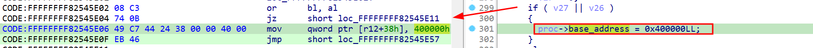

# How to patch the running kernel properly on the PS4 (Practical example)


One of the first tasks when hacking into the PlayStation kernel is to apply proper patches. Perhaps enabling the UART for better logging using serial COM, enabling user/kernel address access, or even enabling the MAP_SELF flag support into the `mmap` syscall, which can be used to decrypt native modules using the SAMU behind the scenes.

The first step is actually acquiring the kernel. You can do this by using the [PS4-Kernel-Dumper](https://github.com/Scene-Collective/ps4-kernel-dumper.git) payload on your hacked PS4. After acquiring the kernel image, you can either reverse the kernel by yourself or search for known offsets.

## Calculating the correct offset

The simplest way to calculate the offset is by subtracting the wanted address from the kernel base. This is required since the PS4 implements [KASLR](https://en.wikipedia.org/wiki/Address_space_layout_randomization). For example, let's calculate the offset of the usermode process ASLR calculation inside the kernel image. I'm using firmware version `10.5`:



I will not enter into the details of this function, but in general, it's where the `SELF` ([Signed ELF](https://www.psdevwiki.com/ps4/SELF_File_Format)) image is parsed and the process is created. One of the steps is to define the image base address using ASLR. If some specific conditions are matched, it will use a fixed base address of `0x400000`, which is great to have all the time to make debugging easier. So, in order to apply the kernel patch, we can just `nop` the `jz` conditional instruction to always set the base address to a fixed one, even if it's not supposed to.


The `jz` address in the dumped kernel is `0xFFFFFFFF82545E04`, and the kernel base address (not loaded) is `0xFFFFFFFF82200000`, so the offset is `0xFFFFFFFF82545E04 - 0xFFFFFFFF82200000 = 0x345e04`.


## Getting the running kernel base address

Since we do have the dumped kernel in our hands, we can pick any known previous offset and calculate with the same one in memory to pick the kernel base address. The most used one is the address contained in the `MSR_LSTAR`(0xc0000082) MSR, which is the MSR used to store the syscall [handling](https://lwn.net/Articles/604287/) address, picking this address is very straight forward using the `rdmsr` instruction, with that in hands we can easily calculate the current kernel base address:


```c
inline uint64_t __readmsr(uint32_t msr)
{
    uint32_t low, high;
    asm volatile("rdmsr" : "=a"(low), "=d"(high) : "c"(msr));

    return (low | ((uint64_t) high << 32));
}


inline uint64_t get_kernel_base_addr()
{
    return __readmsr(MSR_LSTAR) - kldsym_addr_Xfast_syscall;
}
```