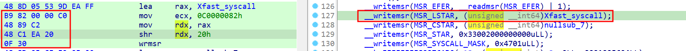

# How to patch the running kernel properly on the PS4 (Practical example)


One of the first tasks when hacking into the PlayStation kernel is to apply proper patches. Perhaps enabling the UART for better logging using serial COM, enabling user/kernel address access, or even enabling the MAP_SELF flag support into the `mmap` syscall, which can be used to decrypt native modules using the SAMU behind the scenes.

The first step is actually acquiring the kernel. You can do this by using the [PS4-Kernel-Dumper](https://github.com/Scene-Collective/ps4-kernel-dumper.git) payload on your hacked PS4. After acquiring the kernel image, you can either reverse the kernel by yourself or search for known offsets.

## Calculating the correct offset

The simplest way to calculate the offset is by subtracting the wanted address from the kernel base. This is required since the PS4 implements [KASLR](https://en.wikipedia.org/wiki/Address_space_layout_randomization). For example, let's calculate the offset of the usermode process ASLR calculation inside the kernel image. I'm using firmware version `10.5`:


I will not enter into the details of this function, but in general, it's where the `SELF` ([Signed ELF](https://www.psdevwiki.com/ps4/SELF_File_Format)) image is parsed and the process is created. One of the steps is to define the image base address using ASLR. If some specific conditions are matched, it will use a fixed base address of `0x400000`, which is great to have all the time to make debugging easier. So, in order to apply the kernel patch, we can just `nop` the `jz` conditional instruction to always set the base address to a fixed one, even if it's not supposed to.


The `jz` address in the dumped kernel is `0xFFFFFFFF82545E04`, and the kernel base address (not loaded) is `0xFFFFFFFF82200000`, so the offset is `0xFFFFFFFF82545E04 - 0xFFFFFFFF82200000 = 0x345e04`.


## Getting the running kernel base address

Since we have the dumped kernel in our hands, we can pick any known previous offset and calculate the same one in memory to determine the kernel base address. One of the most commonly used methods is to extract the address contained in the `MSR_LSTAR` (0xc0000082) MSR, which is the MSR used to store the syscall [handling](https://lwn.net/Articles/604287/) address. Picking this address is very straightforward using the `rdmsr` instruction. With that in hand, we can easily calculate the current kernel base address:


```c
inline uint64_t __readmsr(uint32_t msr) // wrapper into the rdmsr instruction
{
    uint32_t low, high;
    asm volatile("rdmsr" : "=a"(low), "=d"(high) : "c"(msr));

    return (low | ((uint64_t) high << 32));
}


inline uint64_t get_kernel_base_addr()
{
    return __readmsr(MSR_LSTAR) - Xfast_syscall_offset;
}
```


The quickest way to find the `Xfast_syscall_offset` value is by looking into the kernel image for writemsr into the `MSR_LSTAR`. It occurs in the earliest parts of the firmware code. One can easily find it by searching for the following code pattern: `B9 82 00 00 C0 48 89 C2 48 C1 EA 20 0F 30`, which are the opcodes used when writing into it:



In general, once you pick that offset and subtract the running (with KASLR) Xfast address, you will get the kernel base address. This idea can be applied with any previously known offsets that you can find at runtime as well. For contrast, that's how the PPPwn exploit from [TheFlow](https://github.com/TheOfficialFloW/PPPwn) [defeats](https://github.com/TheOfficialFloW/PPPwn/blob/e61e6e78f643dc1ef2233bb7693a4608d5234ce0/pppwn.py#L768) KASLR, but instead of use the `Xfast_syscall` offset, it make use of the `PPPOE_SOFTC_LIST` offset, which is part of the vulnerability itself.

## Patching the kernel


With the kernel base address acquired, before any patch can be applied, you must disable the `Write Protect` bit from the `CR0` register ([AMD's](https://www.amd.com/content/dam/amd/en/documents/processor-tech-docs/programmer-references/24593.pdf) manual - ***3.1.1 CR0 Register***). This bit controls permissions to write into read-only pages. Since the kernel code itself (.text) isn't writable, one must first disable this bit, patch it, and then re-enable it. Since writing kernel payloads in the PS4 jailbreak context means that you are already running after a kernel exploit, you have the ability to read/write into control registers.


```c

inline uint64_t __readcr0()
{
    uint64_t value;
    asm volatile("movq %%cr0, %0" : "=r"(value));
    return value;
}

inline void __writecr0(uint64_t value)
{
    asm volatile("movq %0, %%cr0" ::"r"(value));
}
...
uint64_t cr0 = __readcr0(); // store the cr0
__writecr0(cr0 & ~CR0_WP); // Disable write protection in read-only pages, allows us to patch the running kernel


// Freely patch the kernel code

__writecr0(cr0); // restore the original cr0
```


To patch it, you can treat the kernel image as a regular `uint8_t*` buffer or something similar, and simply write the required opcodes into it.

## Links & resources

- [PS4-Kernel-Dumper](https://github.com/Scene-Collective/ps4-kernel-dumper)
- [PPPwn stage 1 source code](https://github.com/TheOfficialFloW/PPPwn/blob/master/stage1/stage1.c)
- [Mira "CFW" project](https://github.com/OpenOrbis/mira-project)
- [AMD64 manual](https://www.amd.com/content/dam/amd/en/documents/processor-tech-docs/programmer-references/24593.pdf)


